<div align="center">
<h1>Postman ML/DL Recruitment Task - Round 2</h1>

A report documenting my approach towards completing the task.
</div>

Unmodified `.csv` file: `original.csv`

Processed `.csv` file: `processed.csv`

All of the code was executed on a terminal environment, on my
local machine. Each file should be executed in their directories,
because they refer to the processed dataset using relative paths

Sections:

* [(1) Exploratory Data Analysis](https://github.com/cross-codes/Postman-ML-Task-2#1-exploratory-data-analysis)
  * [(1.1) Scouting](https://github.com/cross-codes/Postman-ML-Task-2#11-scouting)
  * [(1.2) Data Cleansing Process](https://github.com/cross-codes/Postman-ML-Task-2#12-data-cleansing-process)
    * [(1.2.1) Removing Null values and Duplicates](https://github.com/cross-codes/Postman-ML-Task-2#121-removing-null-values-and-duplicates)
    * [(1.2.2) Addressing Outliers](https://github.com/cross-codes/Postman-ML-Task-2#122-addressing-outliers)
    * [(1.2.3) Converting data types](https://github.com/cross-codes/Postman-ML-Task-2#123-converting-data-types)
    * [(1.2.4) Feature Engineering](https://github.com/cross-codes/Postman-ML-Task-2#124-feature-engineering)

* [(2) Data Plotting](https://github.com/cross-codes/Postman-ML-Task-2#2-data-plotting)
  * [(2.1) Histograms](https://github.com/cross-codes/Postman-ML-Task-2#21-histograms)
  * [(2.2) Heatmaps](https://github.com/cross-codes/Postman-ML-Task-2#22-heatmaps)
  * [(2.3) Bar Graphs](https://github.com/cross-codes/Postman-ML-Task-2#23-bar-graphs)

* [(3) Model Making](https://github.com/cross-codes/Postman-ML-Task-2#3-model-making)
  * [(3.1) Linear Regression](https://github.com/cross-codes/Postman-ML-Task-2#31-linear-regression)
  * [(3.2) Support Vector Machine](https://github.com/cross-codes/Postman-ML-Task-2#32-support-vector-machine)
  * [(3.3) Random Forest Classifier](https://github.com/cross-codes/Postman-ML-Task-2#33-random-forest-classifier)
  * [(3.4) Gaussian Naive Bayes Classifier](https://github.com/cross-codes/Postman-ML-Task-2#34-gaussian-naive-bayes-classifier)
  * [(3.5) Gradient Boosting Classifier](https://github.com/cross-codes/Postman-ML-Task-2#35-gradient-boosting-classifier)

* [Verdict](https://github.com/cross-codes/Postman-ML-Task-2#verdict)

---

## (1) Exploratory Data Analysis

#### (1.1) Scouting

There are no descriptions for any of the columns, but here are my  guesses:

(O) -> Potential outliers

(G) -> Using an educated guess

(U) -> Unknown meaning/interpretation

| Column Name        | Description                                                                                          |
|--------------------|------------------------------------------------------------------------------------------------------|
| sex                | Male -> (M) Female -> (F)                                                                            |
| age                | Measured in years                                                                                   |
| height             | Measured in cm                                                                                      |
| weight             | Measured in kg                                                                                      |
| waistline          | Most likely unit is cm                                                                              |
| sight_left (O)     | Unit unknown. - Most values in [0, 2]. - Outlier at 9.9                                             |
| sight_right (O)    | Unit unknown. - Most values in [0, 2]. - Outlier at 9.9                                             |
| hear_left (G)      | Unit unknown. - Most values in {1, 2}. - 1 likely corresponds to normal hearing, 2 to impaired hearing |
| hear_right (G)     | Unit unknown. - Most values in {1, 2}. - 1 likely corresponds to normal hearing, 2 to impaired hearing |
| SBP                | Systolic Blood Pressure, a measure of blood pressure when the heart beats. Units seem to be mm of mercury. |
| DBP                | Diastolic Blood Pressure, a measure of blood pressure when the heart is at rest. Units seem to be mm of mercury. |
| BLDS (U)           | I have no idea what this is.                                                                         |
| tot_chole          | Total cholesterol level in the blood. Units are likely mg/dl.                                         |
| HDL_chole          | High-Density Lipoprotein (HDL) cholesterol level in the blood. Units are likely mg/dl.               |
| LDL_chole          | Low-Density Lipoprotein (LDL) cholesterol level in the blood. Units are likely mg/dl.               |
| triglyceride       | Triglyceride level in the blood. Units are likely mg/dl.                                           |
| hemoglobin         | Hemoglobin level in the blood. Units are likely g/dl.                                               |
| urine_protein (G)  | Presence or quantity of protein in the urine. - Expressed in single-digit numbers. - Likely proportional to the amount of protein in the urine. |
| serum_creatinine   | Serum creatinine level in the blood, used to assess kidney function. Units are likely mg/dl.         |
| SGOT_AST           | Serum Glutamic Oxaloacetic Transaminase (SGOT/AST) level in the blood, related to liver function. Units are /l. |
| SGOT_ALT           | Serum Glutamic Pyruvic Transaminase (SGPT/ALT) level in the blood, related to liver function. Units are /l. |
| gamma_GTP          | Gamma-Glutamyl Transferase (GGT or gamma-GTP) level in the blood, related to liver and bile duct function. Units are /l. |
| SMK_stat_type_cd (U) | Smoking status or type of smoking. Values in {1, 2, 3}. Further analysis is required to determine what each number could represent. |
| DRK_YN             | Drinking status. Y (Yes), N (No).                                                                    |

#### (1.2) Data Cleansing process

##### (1.2.1) Removing null values and duplicates

File: `EDA/null_check.py`

```python
import pandas as pd

df = pd.read_csv("../original.csv")

missing_values = df.isnull().sum()

print("Columns with missing values: ")
for column, count in missing_values.items():
    if count > 0:
        print(f"{column}: {count} missing values")
```

No missing values were found

File: `EDA/duplicates.py`

```python
df = pd.read_csv("../original.csv")
print(df[df.duplicated].shape)  # (26, 24) -> 26 duplicates for 24 columns
print(df.describe())
df = df.drop_duplicates(keep="first")
df.to_csv("../processed.csv", index=False)
print(df.describe())
```

Output:

```bash
(26, 24)
                 age         height         weight      waistline  ...       SGOT_AST       SGOT_ALT      gamma_GTP  SMK_stat_type_cd
count  991346.000000  991346.000000  991346.000000  991346.000000  ...  991346.000000  991346.000000  991346.000000     991346.000000
mean       47.614491     162.240625      63.284050      81.233358  ...      25.989308      25.755051      37.136347          1.608122
std        14.181339       9.282957      12.514241      11.850323  ...      23.493386      26.308599      50.424153          0.818507
min        20.000000     130.000000      25.000000       8.000000  ...       1.000000       1.000000       1.000000          1.000000
25%        35.000000     155.000000      55.000000      74.100000  ...      19.000000      15.000000      16.000000          1.000000
50%        45.000000     160.000000      60.000000      81.000000  ...      23.000000      20.000000      23.000000          1.000000
75%        60.000000     170.000000      70.000000      87.800000  ...      28.000000      29.000000      39.000000          2.000000
max        85.000000     190.000000     140.000000     999.000000  ...    9999.000000    7210.000000     999.000000          3.000000

[8 rows x 22 columns]
                 age         height         weight      waistline  ...       SGOT_AST       SGOT_ALT      gamma_GTP  SMK_stat_type_cd
count  991320.000000  991320.000000  991320.000000  991320.000000  ...  991320.000000  991320.000000  991320.000000     991320.000000
mean       47.614529     162.240563      63.283884      81.233255  ...      25.989424      25.755148      37.136152          1.608112
std        14.181346       9.282922      12.514101      11.850296  ...      23.493668      26.308910      50.423811          0.818504
min        20.000000     130.000000      25.000000       8.000000  ...       1.000000       1.000000       1.000000          1.000000
25%        35.000000     155.000000      55.000000      74.100000  ...      19.000000      15.000000      16.000000          1.000000
50%        45.000000     160.000000      60.000000      81.000000  ...      23.000000      20.000000      23.000000          1.000000
75%        60.000000     170.000000      70.000000      87.800000  ...      28.000000      29.000000      39.000000          2.000000
max        85.000000     190.000000     140.000000     999.000000  ...    9999.000000    7210.000000     999.000000          3.000000

[8 rows x 22 columns]
```

It is necessary to remove duplicate entries because we do not
want our models to over-fit. 26 entries is still negligible though.

##### (1.2.2) Addressing outliers

The best method according to most sources is using the interquartile range
approach to detect outliers.
First we start by generating the box plot for every column

File: `EDA/outliers.py`

Images: `EDA/img`

```python
def generate_box_plot(column_name):
    plt.figure(figsize=(10, 6))
    plt.boxplot(df[column_name], vert=False)
    plt.title("Box Plot for " + column_name)
    plt.xlabel(column_name)
    plt.savefig("./img/box_plot_" + column_name + ".png")
    return 0

for column in column_names:
    generate_box_plot(column)
```

where the column_names are defined as:

```python
column_names = [
    "age",
    "height",
    "weight",
    "waistline",
    "sight_left",
    "sight_right",
    "hear_left",
    "hear_right",
    "SBP",
    "DBP",
    "BLDS",
    "tot_chole",
    "HDL_chole",
    "LDL_chole",
    "triglyceride",
    "hemoglobin",
    "urine_protein",
    "serum_creatinine",
    "SGOT_AST",
    "SGOT_ALT",
    "gamma_GTP",
]
```

Then we remove outliers for the following columns:

```python

columns_to_be_removed = [
    "sight_left",
    "sight_right",
    "waistline",
    "SBP",
    "DBP",
    "BLDS",
    "tot_chole",
    "triglyceride",
    "serum_creatinine",
    "SGOT_AST",
    "SGOT_ALT",
]
```

`gamma_GTP` was intentionally left out because I feel like I'd loose a lot of
data considering this box plot:

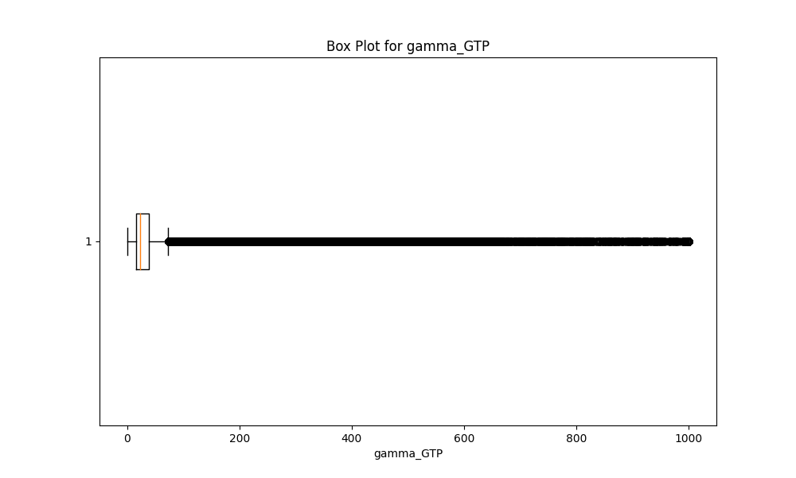

Honestly some of the parameters like `SGOT_AST` really seem important, as a
higher value indicates something related to
alcohol consumption, but I can't really tell how important each entry is,
without a domain expert.

I also have a suspicion that `sight_left` and `sight_right` must lie in (0, 1],
but I have no way to confirm this.

##### (1.2.3) Converting data types

`DRK_YN` contains entires in {"Y", "N"}, so I will convert them into {1, 0}.

I'll also use numbers for gender. {Male, Female} -> {1, 2}

File: `EDA/convert.py`

```python
df = pd.read_csv("../processed.csv")

df["DRK_YN"] = df["DRK_YN"].replace({"Y": 1, "N": 0})
df["sex"] = df["sex"].replace({"Male": 1, "Female": 2})
df.to_csv("../processed.csv", index=False)
```

##### (1.2.4) Feature engineering

This is just adding useful columns derived from other related columns
The height and weight are useful parameters for this test, but I think
it's better if we just combine them and use the BMI instead.

The formula for BMI is $\beta = \frac{\text{Mass(kg)}}{\text{Height(m)}^2}$
So I'm going to add this column next to the weight and height.

From the scouting, the height is in `cm`, so this needs to be accounted for.

File: `EDA/feature_engg.py`

```python
df = pd.read_csv("../processed.csv")
df["bmi"] = round(df["weight"] / ((df["height"] / 100) ** 2), 2)

columns_order = [
    "sex",
    "age",
    "height",
    "weight",
    "bmi",
    "waistline",
    "sight_left",
    "sight_right",
    "hear_left",
    "hear_right",
    "SBP",
    "DBP",
    "BLDS",
    "tot_chole",
    "HDL_chole",
    "LDL_chole",
    "triglyceride",
    "hemoglobin",
    "urine_protein",
    "serum_creatinine",
    "SGOT_AST",
    "SGOT_ALT",
    "gamma_GTP",
    "SMK_stat_type_cd",
    "DRK_YN",
]

df = df[columns_order]
df.to_csv("../processed.csv", index=False)
```

The BMI (rounded off to two decimal) reports is now present next to the weight column

The columns seem to be meaningful in name, and there is only numerical input, so
this concludes my preliminary EDA. I may add more columns as I perform data
plotting however.

---

## (2) Data plotting

The objective is to check the relationship between various entries in the dataset.
To do this, I will try generating histograms,
heatmaps and bar graphs between some relevant quantities

#### (2.1) Histograms

I have used the `seaborn` library to generate some useful counting based histograms

File: `DP/histograms.py`

Image: `DP/img/sb_*.png`

```python
def generate_histplot(column_name):
    df = pd.read_csv("../processed.csv")
    plot.figure(figsize=(12, 6))
    sb.histplot(
        data=df, x=column_name, palette="pastel", hue="DRK_YN", multiple="stack"
    )
    plot.savefig("./img/sb_" + column_name.replace("/", "") + ".png")
    return 0
```

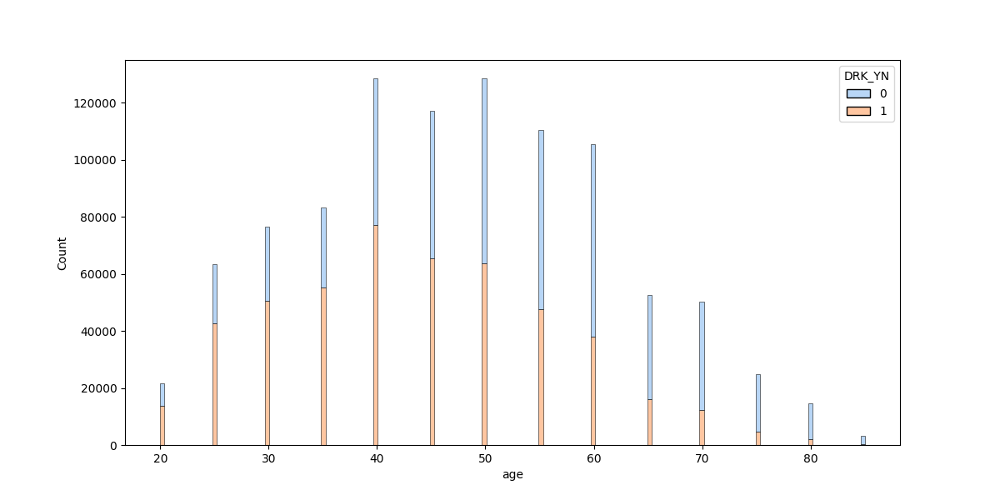
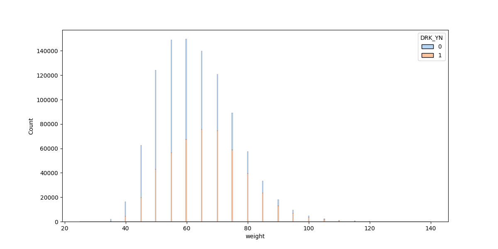
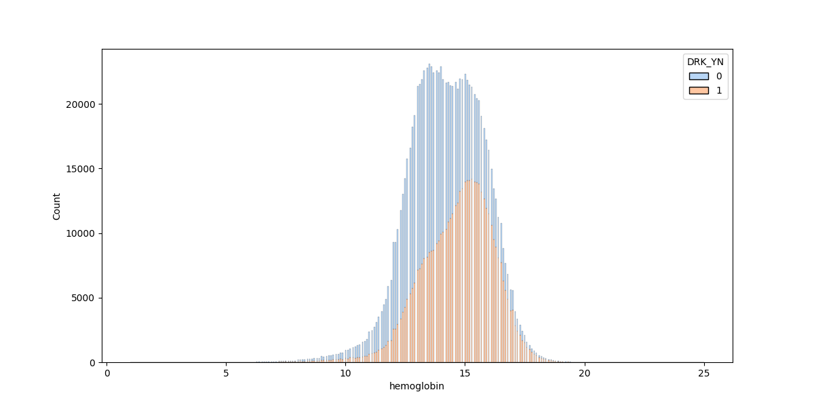
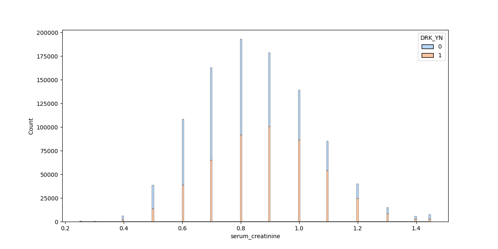
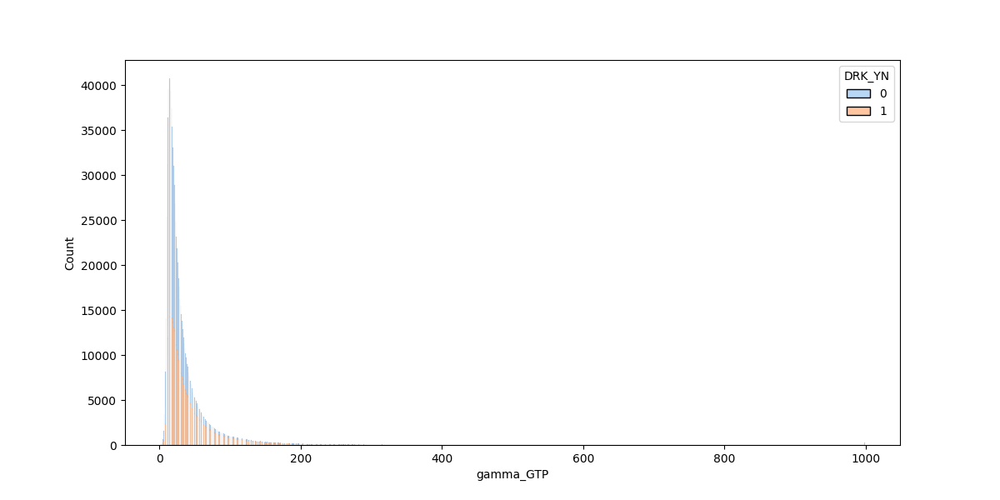
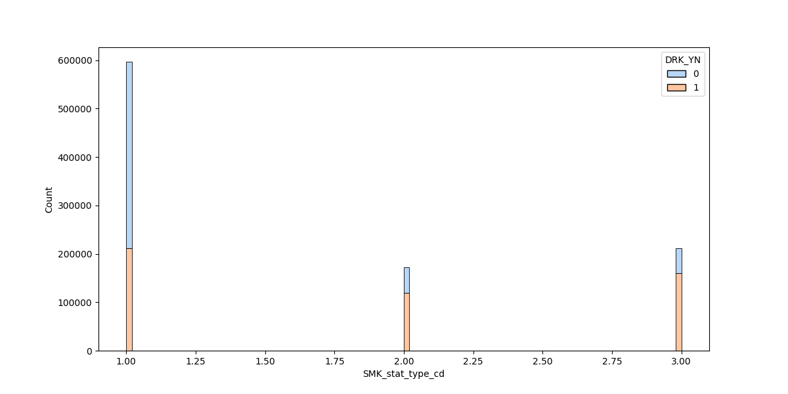
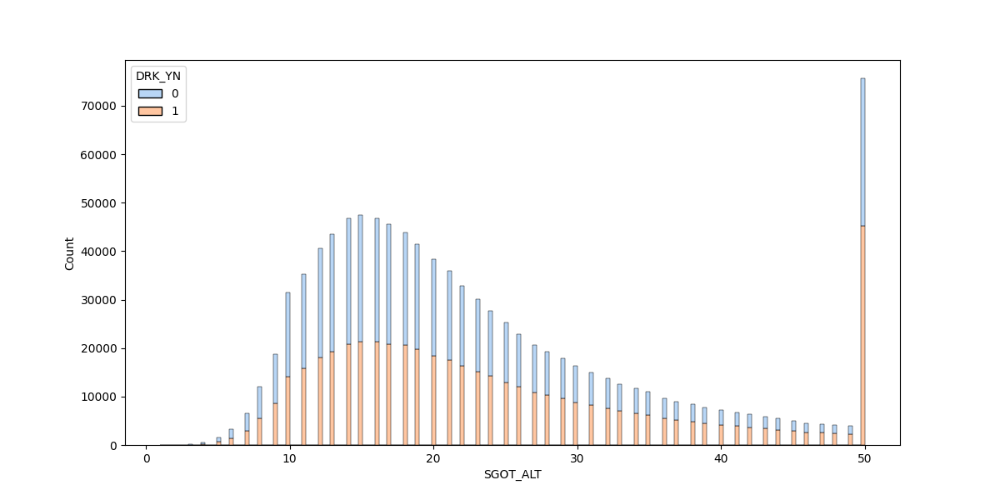
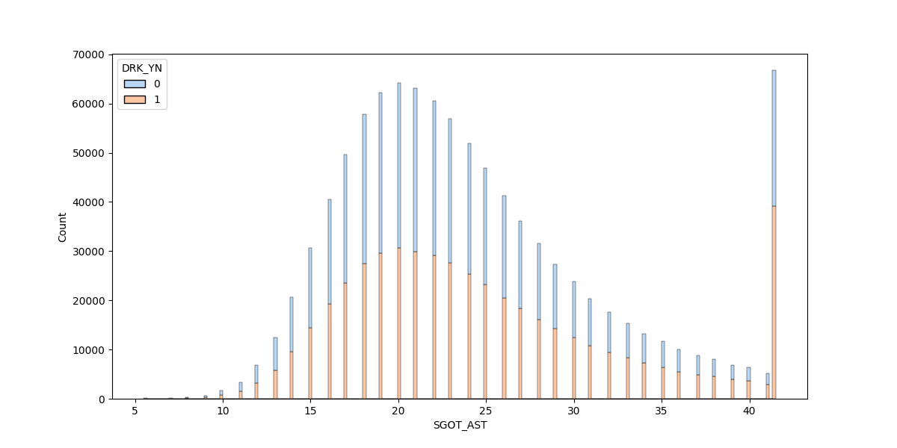

Relevant parameters seem to be `SGOT_AST` and `SGOT_ALT` for drinking.
Further research suggests that the `SGOT_AST`/`SGOT_ALT` ratio is [very
important for drinking detection](https://en.wikipedia.org/wiki/AST/ALT_ratio),
so I will add that as a column (`EDA/feature_engg.py`)

#### (2.2) Heatmaps

A heatmap is a tool to find the correlation strength among variables.
The higher the correlation, the darker the color

File: `DP/heatmaps.py`

Image: `DP/img/heatmap.py`

```python
df = pd.read_csv("../processed.csv")

columns_to_include = [
    "age",
    "height",
    "weight",
    "waistline",
    "sight_left",
    "sight_right",
    "hear_left",
    "hear_right",
    "SBP",
    "DBP",
    "BLDS",
    "tot_chole",
    "HDL_chole",
    "LDL_chole",
    "triglyceride",
    "hemoglobin",
    "urine_protein",
    "serum_creatinine",
    "SGOT_AST",
    "SGOT_ALT",
    "gamma_GTP",
    "SMK_stat_type_cd",
    "DRK_YN",
]

df_subset = df[columns_to_include]

plot.figure(figsize=(12, 10))

heatmap = sb.heatmap(
    df_subset.corr(),
    annot=True,
    cmap="coolwarm",
    fmt=".2f",
    annot_kws={"size": 8},
)

heatmap.set_xticklabels(
    heatmap.get_xticklabels(),
    rotation=45,
    horizontalalignment="right",
)

heatmap.set_aspect("equal")
plot.savefig("./img/heatmap.png", bbox_inches="tight")
```

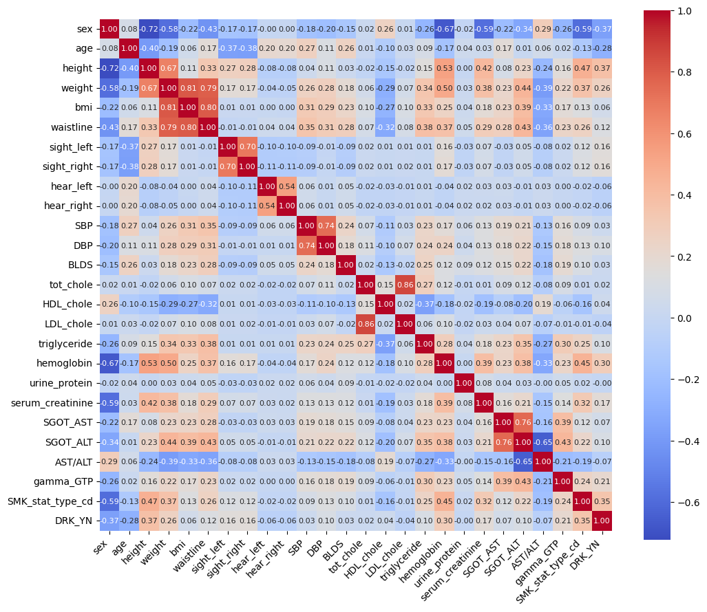

From this heatmap, it becomes immediately clear that the
following parameters have a good correlation
with the drinking status of a person:

(1) Height

(2) Weight

(3) Hemoglobin

(4) Serum Creatinine content

(5) Gamma-Glutamyl content

(6) Smoking status

(7) SGOT_ALT and AST

#### (2.3) Bar Graphs

I plotted some simple bar graphs based on some of the above parameters

File: `DP/bar_graphs.py`

Images: `DP/img/*_bar_graph.py`

```python
df = pd.read_csv("../processed.csv")
plot.hist(df[df["column_1"] == 0]["column_2"], alpha=0.5, label="label1")
plot.hist(df[df["column_1"] == 1]["column_2"], alpha=0.5, label="label2")
plot.xlabel("column_2")
plot.ylabel("Frequency")
plot.legend()
```

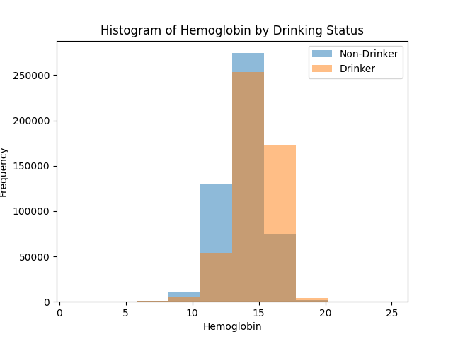
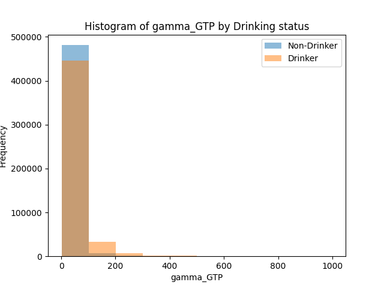

All matching with the heatmap, which was by far the most useful

---

### (3) Model Making

#### (3.1) Linear Regression

File: `models/linear_regression.py`

```python
import time
import pandas as pd
from sklearn.model_selection import train_test_split
from sklearn.linear_model import LinearRegression
from sklearn.metrics import accuracy_score, classification_report
from memory_profiler import profile


@profile
def main():
    start_time = time.time()

    df = pd.read_csv("../processed.csv")
    X = df.drop(
        columns=[
            "DRK_YN",
            "sex",
        ],
        axis=1,
    )
    y = df.DRK_YN

    X_train, X_test, y_train, y_test = train_test_split(
        X, y, test_size=0.2, random_state=69
    )

    model = LinearRegression()
    model.fit(X_train, y_train)

    y_pred = model.predict(X_test)
    accuracy = accuracy_score(y_test, y_pred.round())
    report = classification_report(y_test, y_pred.round())

    print(f"Accuracy: {accuracy:.2f}")
    print("Classification Report:")
    print(report)

    end_time = time.time()
    elapsed_time = end_time - start_time

    print(f"Time taken: {elapsed_time:.2f} seconds")


if __name__ == "__main__":
    main()
```

The result is as follows:

```bash
Accuracy: 0.72
Classification Report:
              precision    recall  f1-score   support

        -2.0       0.00      0.00      0.00         0
        -1.0       0.00      0.00      0.00         0
         0.0       0.71      0.74      0.73     98304
         1.0       0.73      0.69      0.71     97861
         2.0       0.00      0.00      0.00         0

    accuracy                           0.72    196165
   macro avg       0.29      0.29      0.29    196165
weighted avg       0.72      0.72      0.72    196165

Time taken: 1.84 seconds
Filename: linear_regression.py

Line #    Mem usage    Increment  Occurrences   Line Contents
=============================================================
     9    147.4 MiB    147.4 MiB           1   @profile
    10                                         def main():
    11    147.4 MiB      0.0 MiB           1       start_time = time.time()
    12                                         
    13    344.0 MiB    196.6 MiB           1       df = pd.read_csv("../processed.csv")
    14    524.5 MiB    180.5 MiB           2       X = df.drop(
    15    344.0 MiB      0.0 MiB           1           columns=[
    16    344.0 MiB      0.0 MiB           1               "DRK_YN",
    17    344.0 MiB      0.0 MiB           1               "sex",
    18                                                     # "hear_left",
    19                                                     # "hear_right",
    20                                                     # "LDL_chole",
    21                                                     # "urine_protein",
    22                                                 ],
    23    344.0 MiB      0.0 MiB           1           axis=1,
    24                                             )
    25    524.5 MiB      0.0 MiB           1       y = df.DRK_YN
    26                                         
    27    742.2 MiB    217.7 MiB           2       X_train, X_test, y_train, y_test = train_test_split(
    28    524.5 MiB      0.0 MiB           1           X, y, test_size=0.2, random_state=69
    29                                             )
    30                                         
    31    742.2 MiB      0.0 MiB           1       model = LinearRegression()
    32    769.4 MiB     27.2 MiB           1       model.fit(X_train, y_train)
    33                                         
    34    769.6 MiB      0.1 MiB           1       y_pred = model.predict(X_test)
    35    769.6 MiB      0.0 MiB           1       accuracy = accuracy_score(y_test, y_pred.round())
    36    770.1 MiB      0.5 MiB           1       report = classification_report(y_test, y_pred.round())
    37                                         
    38    770.1 MiB      0.0 MiB           1       print(f"Accuracy: {accuracy:.2f}")
    39    770.1 MiB      0.0 MiB           1       print("Classification Report:")
    40    770.1 MiB      0.0 MiB           1       print(report)
    41                                         
    42    770.1 MiB      0.0 MiB           1       end_time = time.time()
    43    770.1 MiB      0.0 MiB           1       elapsed_time = end_time - start_time
    44                                         
    45    770.1 MiB      0.0 MiB           1       print(f"Time taken: {elapsed_time:.2f} seconds")

```

However, I was able to optimise this by simply not including
columns with negative or zero correlation with `DRK_YN`

In particular, when

```python
columns=[
    "DRK_YN",
    "sex",
    "hear_left",
    "hear_right",
    "LDL_chole",
    "urine_protein",
]
```

The result is faster, but just as accurate

```bash
Accuracy: 0.72
Classification Report:
              precision    recall  f1-score   support

         0.0       0.71      0.74      0.73     98304
         1.0       0.73      0.69      0.71     97861
         2.0       0.00      0.00      0.00         0

    accuracy                           0.72    196165
   macro avg       0.48      0.48      0.48    196165
weighted avg       0.72      0.72      0.72    196165

Time taken: 1.72 seconds
Filename: linear_regression.py

Line #    Mem usage    Increment  Occurrences   Line Contents
=============================================================
     9    147.5 MiB    147.5 MiB           1   @profile
    10                                         def main():
    11    147.5 MiB      0.0 MiB           1       start_time = time.time()
    12                                         
    13    343.7 MiB    196.1 MiB           1       df = pd.read_csv("../processed.csv")
    14    494.3 MiB    150.6 MiB           2       X = df.drop(
    15    343.7 MiB      0.0 MiB           1           columns=[
    16                                                     "DRK_YN",
    17                                                     "sex",
    18                                                     "hear_left",
    19                                                     "hear_right",
    20                                                     "LDL_chole",
    21                                                     "urine_protein",
    22                                                 ],
    23    343.7 MiB      0.0 MiB           1           axis=1,
    24                                             )
    25    494.3 MiB      0.0 MiB           1       y = df.DRK_YN
    26                                         
    27    681.9 MiB    187.7 MiB           2       X_train, X_test, y_train, y_test = train_test_split(
    28    494.3 MiB      0.0 MiB           1           X, y, test_size=0.2, random_state=69
    29                                             )
    30                                         
    31    681.9 MiB      0.0 MiB           1       model = LinearRegression()
    32    706.5 MiB     24.5 MiB           1       model.fit(X_train, y_train)
    33                                         
    34    721.6 MiB     15.1 MiB           1       y_pred = model.predict(X_test)
    35    721.6 MiB      0.0 MiB           1       accuracy = accuracy_score(y_test, y_pred.round())
    36    722.1 MiB      0.5 MiB           1       report = classification_report(y_test, y_pred.round())
    37                                         
    38    722.1 MiB      0.0 MiB           1       print(f"Accuracy: {accuracy:.2f}")
    39    722.1 MiB      0.0 MiB           1       print("Classification Report:")
    40    722.1 MiB      0.0 MiB           1       print(report)
    41                                         
    42    722.1 MiB      0.0 MiB           1       end_time = time.time()
    43    722.1 MiB      0.0 MiB           1       elapsed_time = end_time - start_time
    44                                         
    45    722.1 MiB      0.0 MiB           1       print(f"Time taken: {elapsed_time:.2f} seconds")
```

#### (3.2) Support Vector Machine

File: `models/svm.py`

```python
import time
import pandas as pd
from sklearn.model_selection import train_test_split
from sklearn.svm import SVC
from sklearn.metrics import accuracy_score, classification_report

start_time = time.time()

df = pd.read_csv("../processed.csv")
X = df.drop(columns=["DRK_YN", "sex"], axis=1)
y = df.DRK_YN

X_train, X_test, y_train, y_test = train_test_split(
    X, y, test_size=0.2, random_state=69
)

svmc = SVC(kernel="rbf", C=1.0)
svmc.fit(X_train, y_train)


y_pred = svmc.predict(X_test)
accuracy = accuracy_score(y_test, y_pred.round())
report = classification_report(y_test, y_pred.round())

print(f"Accuracy: {accuracy:.2f}")
print("Classification Report:")
print(report)

end_time = time.time()
elapsed_time = end_time - start_time

print(f"Time taken: {elapsed_time:.2f} seconds")
```

I did not know the underlying distribution, so I choose a radial basis function
in the `kernel` parameter

Even if there were any potential gains in accuracy, the time
this model takes drags this down. The program was not finished
executing even after 2 hours.

#### (3.3) Random Forest Classifier

File: `models/random_forests.py`

```python
import time
import pandas as pd
from sklearn.model_selection import train_test_split
from sklearn.ensemble import RandomForestClassifier
from sklearn.metrics import accuracy_score, classification_report
from memory_profiler import profile


@profile
def main():
    start_time = time.time()

    df = pd.read_csv("../processed.csv")
    X = df.drop(columns=["DRK_YN", "sex"], axis=1)
    y = df.DRK_YN

    X_train, X_test, y_train, y_test = train_test_split(
        X, y, test_size=0.2, random_state=69
    )

    model = RandomForestClassifier(n_estimators=100, random_state=69, n_jobs=-1)
    model.fit(X_train, y_train)

    y_pred = model.predict(X_test)
    accuracy = accuracy_score(y_test, y_pred)
    report = classification_report(y_test, y_pred)

    print(f"Accuracy: {accuracy:.2f}")
    print("Classification Report:")
    print(report)

    end_time = time.time()
    elapsed_time = end_time - start_time

    print(f"Time taken: {elapsed_time:.2f} seconds")


if __name__ == "__main__":
    main()
```

The result is as follows:

```bash
Accuracy: 0.73
Classification Report:
              precision    recall  f1-score   support

           0       0.73      0.74      0.73     98304
           1       0.73      0.72      0.73     97861

    accuracy                           0.73    196165
   macro avg       0.73      0.73      0.73    196165
weighted avg       0.73      0.73      0.73    196165

Time taken: 77.62 seconds
Filename: random_forests.py

Line #    Mem usage    Increment  Occurrences   Line Contents
=============================================================
     9    154.0 MiB    154.0 MiB           1   @profile
    10                                         def main():
    11    154.0 MiB      0.0 MiB           1       start_time = time.time()
    12                                         
    13    480.9 MiB    326.8 MiB           1       df = pd.read_csv("../processed.csv")
    14    556.6 MiB     75.8 MiB           1       X = df.drop(columns=["DRK_YN", "sex"], axis=1)
    15    556.6 MiB      0.0 MiB           1       y = df.DRK_YN
    16                                         
    17    748.9 MiB    192.2 MiB           2       X_train, X_test, y_train, y_test = train_test_split(
    18    556.6 MiB      0.0 MiB           1           X, y, test_size=0.2, random_state=69
    19                                             )
    20                                         
    21    748.9 MiB      0.0 MiB           1       model = RandomForestClassifier(n_estimators=100, random_state=69, n_jobs=-
1)
    22   3664.8 MiB   2915.9 MiB           1       model.fit(X_train, y_train)
    23                                         
    24   3688.7 MiB     23.9 MiB           1       y_pred = model.predict(X_test)
    25   3688.7 MiB      0.0 MiB           1       accuracy = accuracy_score(y_test, y_pred)
    26   3688.8 MiB      0.1 MiB           1       report = classification_report(y_test, y_pred)
    27                                         
    28   3688.8 MiB      0.0 MiB           1       print(f"Accuracy: {accuracy:.2f}")
    29   3688.8 MiB      0.0 MiB           1       print("Classification Report:")
    30   3688.8 MiB      0.0 MiB           1       print(report)
    31                                         
    32   3688.8 MiB      0.0 MiB           1       end_time = time.time()
    33   3688.8 MiB      0.0 MiB           1       elapsed_time = end_time - start_time
    34                                         
    35   3688.8 MiB      0.0 MiB           1       print(f"Time taken: {elapsed_time:.2f} seconds")
```

It is only slightly more accurate than a linear regression
but the amount of time it takes is far more.
I also set `n_jobs=-1` to use all of my cores. Without this
the process took over 3 minutes

RFC is also sensitive to quantities high intercorrelation. I
tried dropping some columns that were correlated with a lot of
others, and trained it on a smaller dataset, but no significant
change was noted.

#### (3.4) Gaussian Naive Bayes Classifier

File: `models/naive_bayes.py`

```python
import time
import pandas as pd
from sklearn.model_selection import train_test_split
from sklearn.naive_bayes import GaussianNB
from sklearn.metrics import accuracy_score, classification_report
from memory_profiler import profile


@profile
def main():
    start_time = time.time()

    df = pd.read_csv("../processed.csv")
    X = df.drop(
        columns=[
            "DRK_YN",
            "sex",
        ],
        axis=1,
    )
    y = df.DRK_YN

    X_train, X_test, y_train, y_test = train_test_split(
        X, y, test_size=0.2, random_state=69
    )

    model = GaussianNB()
    model.fit(X_train, y_train)

    y_pred = model.predict(X_test)
    accuracy = accuracy_score(y_test, y_pred)
    report = classification_report(y_test, y_pred)

    print(f"Accuracy: {accuracy:.2f}")
    print("Classification Report:")
    print(report)

    end_time = time.time()
    elapsed_time = end_time - start_time

    print(f"Time taken: {elapsed_time:.2f} seconds")


if __name__ == "__main__":
    main()
```

The results are as follows:

```bash
Accuracy: 0.69
Classification Report:
              precision    recall  f1-score   support

           0       0.68      0.71      0.69     98304
           1       0.70      0.66      0.68     97861

    accuracy                           0.69    196165
   macro avg       0.69      0.69      0.69    196165
weighted avg       0.69      0.69      0.69    196165

Time taken: 1.69 seconds
Filename: naive_bayes.py

Line #    Mem usage    Increment  Occurrences   Line Contents
=============================================================
     9    143.5 MiB    143.5 MiB           1   @profile
    10                                         def main():
    11    143.5 MiB      0.0 MiB           1       start_time = time.time()
    12                                         
    13    339.9 MiB    196.4 MiB           1       df = pd.read_csv("../processed.csv")
    14    520.5 MiB    180.6 MiB           2       X = df.drop(
    15    339.9 MiB      0.0 MiB           1           columns=[
    16    339.9 MiB      0.0 MiB           1               "DRK_YN",
    17    339.9 MiB      0.0 MiB           1               "sex",
    18                                                     # "hear_left",
    19                                                     # "hear_right",
    20                                                     # "LDL_chole",
    21                                                     # "urine_protein",
    22                                                 ],
    23    339.9 MiB      0.0 MiB           1           axis=1,
    24                                             )
    25    520.5 MiB      0.0 MiB           1       y = df.DRK_YN
    26                                         
    27    738.2 MiB    217.7 MiB           2       X_train, X_test, y_train, y_test = train_test_split(
    28    520.5 MiB      0.0 MiB           1           X, y, test_size=0.2, random_state=69
    29                                             )
    30                                         
    31    738.2 MiB      0.0 MiB           1       model = GaussianNB()
    32    739.2 MiB      1.0 MiB           1       model.fit(X_train, y_train)
    33                                         
    34    741.4 MiB      2.2 MiB           1       y_pred = model.predict(X_test)
    35    741.4 MiB      0.0 MiB           1       accuracy = accuracy_score(y_test, y_pred)
    36    741.5 MiB      0.1 MiB           1       report = classification_report(y_test, y_pred)
    37                                         
    38    741.5 MiB      0.0 MiB           1       print(f"Accuracy: {accuracy:.2f}")
    39    741.5 MiB      0.0 MiB           1       print("Classification Report:")
    40    741.5 MiB      0.0 MiB           1       print(report)
    41                                         
    42    741.5 MiB      0.0 MiB           1       end_time = time.time()
    43    741.5 MiB      0.0 MiB           1       elapsed_time = end_time - start_time
    44                                         
    45    741.5 MiB      0.0 MiB           1       print(f"Time taken: {elapsed_time:.2f} seconds")
```

Since GNB assumes each parameter is independent
(which is obviously not true from the heatmap), I improved the performace
by dropping columns with a low correlation like in (3.1)

The accuracy did not improve, but it is faster

```bash
Accuracy: 0.69
Classification Report:
              precision    recall  f1-score   support

           0       0.67      0.75      0.71     98304
           1       0.71      0.63      0.67     97861

    accuracy                           0.69    196165
   macro avg       0.69      0.69      0.69    196165
weighted avg       0.69      0.69      0.69    196165

Time taken: 1.50 seconds
Filename: naive_bayes.py

Line #    Mem usage    Increment  Occurrences   Line Contents
=============================================================
     9    143.8 MiB    143.8 MiB           1   @profile
    10                                         def main():
    11    143.8 MiB      0.0 MiB           1       start_time = time.time()
    12                                         
    13    340.2 MiB    196.4 MiB           1       df = pd.read_csv("../processed.csv")
    14    491.0 MiB    150.8 MiB           2       X = df.drop(
    15    340.2 MiB      0.0 MiB           1           columns=[
    16                                                     "DRK_YN",
    17                                                     "sex",
    18                                                     "hear_left",
    19                                                     "hear_right",
    20                                                     "LDL_chole",
    21                                                     "urine_protein",
    22                                                 ],
    23    340.2 MiB      0.0 MiB           1           axis=1,
    24                                             )
    25    491.0 MiB      0.0 MiB           1       y = df.DRK_YN
    26                                         
    27    678.6 MiB    187.6 MiB           2       X_train, X_test, y_train, y_test = train_test_split(
    28    491.0 MiB      0.0 MiB           1           X, y, test_size=0.2, random_state=69
    29                                             )
    30                                         
    31    678.6 MiB      0.0 MiB           1       model = GaussianNB()
    32    679.6 MiB      1.0 MiB           1       model.fit(X_train, y_train)
    33                                         
    34    711.8 MiB     32.2 MiB           1       y_pred = model.predict(X_test)
    35    711.8 MiB      0.0 MiB           1       accuracy = accuracy_score(y_test, y_pred)
    36    711.8 MiB      0.0 MiB           1       report = classification_report(y_test, y_pred)
    37                                         
    38    711.8 MiB      0.0 MiB           1       print(f"Accuracy: {accuracy:.2f}")
    39    711.8 MiB      0.0 MiB           1       print("Classification Report:")
    40    711.8 MiB      0.0 MiB           1       print(report)
    41                                         
    42    711.8 MiB      0.0 MiB           1       end_time = time.time()
    43    711.8 MiB      0.0 MiB           1       elapsed_time = end_time - start_time
    44                                         
    45    711.8 MiB      0.0 MiB           1       print(f"Time taken: {elapsed_time:.2f} seconds")
```

#### (3.5) Gradient Boosting Classifier

File: `models/gradient_boosting.py`

```python
import time
import pandas as pd
from sklearn.model_selection import train_test_split
from sklearn.ensemble import GradientBoostingClassifier
from sklearn.metrics import accuracy_score, classification_report
from memory_profiler import profile


@profile
def main():
    start_time = time.time()

    df = pd.read_csv("../processed.csv")
    X = df.drop(
        columns=[
            "DRK_YN",
            "sex",
            "hear_left",
            "hear_right",
            "LDL_chole",
            "urine_protein",
        ],
        axis=1,
    )
    y = df.DRK_YN

    X_train, X_test, y_train, y_test = train_test_split(
        X, y, test_size=0.2, random_state=69
    )

    model = GradientBoostingClassifier(n_estimators=100, random_state=69)
    model.fit(X_train, y_train)

    y_pred = model.predict(X_test)
    accuracy = accuracy_score(y_test, y_pred)
    report = classification_report(y_test, y_pred)

    print(f"Accuracy: {accuracy:.2f}")
    print("Classification Report:")
    print(report)

    end_time = time.time()
    elapsed_time = end_time - start_time

    print(f"Time taken: {elapsed_time:.2f} seconds")


if __name__ == "__main__":
    main()
```

The results are as follows:

```bash
Accuracy: 0.73
Classification Report:
              precision    recall  f1-score   support

           0       0.74      0.73      0.73     98304
           1       0.73      0.74      0.73     97861

    accuracy                           0.73    196165
   macro avg       0.73      0.73      0.73    196165
weighted avg       0.73      0.73      0.73    196165

Time taken: 184.72 seconds
Filename: gradient_boosting.py

Line #    Mem usage    Increment  Occurrences   Line Contents
=============================================================
     9    154.0 MiB    154.0 MiB           1   @profile
    10                                         def main():
    11    154.0 MiB      0.0 MiB           1       start_time = time.time()
    12                                         
    13    350.5 MiB    196.5 MiB           1       df = pd.read_csv("../processed.csv")
    14    501.2 MiB    150.7 MiB           2       X = df.drop(
    15    350.5 MiB      0.0 MiB           1           columns=[
    16                                                     "DRK_YN",
    17                                                     "sex",
    18                                                     "hear_left",
    19                                                     "hear_right",
    20                                                     "LDL_chole",
    21                                                     "urine_protein",
    22                                                 ],
    23    350.5 MiB      0.0 MiB           1           axis=1,
    24                                             )
    25    501.3 MiB      0.1 MiB           1       y = df.DRK_YN
    26                                         
    27    689.1 MiB    187.8 MiB           2       X_train, X_test, y_train, y_test = train_test_split(
    28    501.3 MiB      0.0 MiB           1           X, y, test_size=0.2, random_state=69
    29                                             )
    30                                         
    31    689.1 MiB      0.0 MiB           1       model = GradientBoostingClassifier(n_estimators=100, random_state=69)
    32    689.7 MiB      0.6 MiB           1       model.fit(X_train, y_train)
    33                                         
    34    734.4 MiB     44.8 MiB           1       y_pred = model.predict(X_test)
    35    734.4 MiB      0.0 MiB           1       accuracy = accuracy_score(y_test, y_pred)
    36    734.6 MiB      0.1 MiB           1       report = classification_report(y_test, y_pred)
    37                                         
    38    734.6 MiB      0.0 MiB           1       print(f"Accuracy: {accuracy:.2f}")
    39    734.6 MiB      0.0 MiB           1       print("Classification Report:")
    40    734.6 MiB      0.0 MiB           1       print(report)
    41                                         
    42    734.6 MiB      0.0 MiB           1       end_time = time.time()
    43    734.6 MiB      0.0 MiB           1       elapsed_time = end_time - start_time
    44                                         
    45    734.6 MiB      0.0 MiB           1       print(f"Time taken: {elapsed_time:.2f} seconds")
```

This is similar to the random forests performance, which is
expected because they are both based off decision trees.

Unfortunately the scikit-learn library does not support
parallelization for gradient boosting, so it could not be improved with respect to time

---

### Verdict

Among the 5 models tested, the linear regression model had the
highest accuracy while being very fast. The Naive Bayes
classifier was the fastest, but it was less accurate, possibly
because of the high intercorrelation between the data

The most accurate model I tested were ones based on decision
trees. Both random forests and gradient boosting had similar
accuracies, but consumed far too many resources and time.

The SVM model took an undermined amount of time to finish.

---
